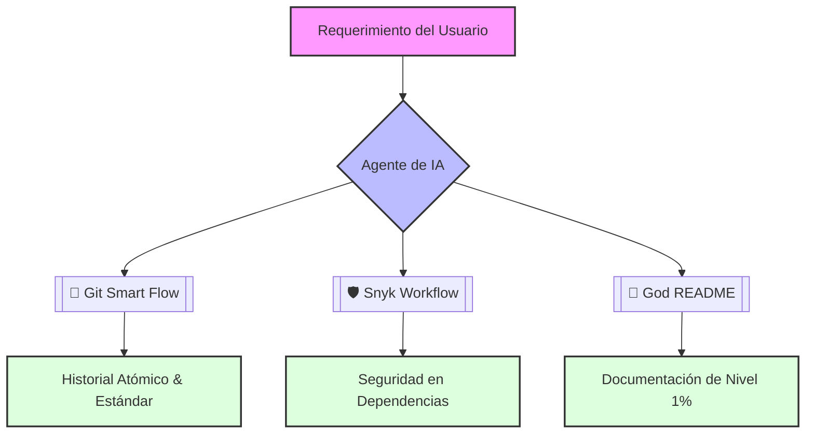

# 🌌 Antigravity Agent Skills Library

> Colección de flujos de trabajo de **élite** y herramientas de andamiaje para agentes de IA de grado ingeniería.

[](https://github.com/Ivan-Madera/Agent-skills)
[](https://github.com/Ivan-Madera/Agent-skills)
[](https://github.com/Ivan-Madera/Agent-skills)

Este repositorio contiene un conjunto de **skills** diseñadas para elevar la calidad del desarrollo de software, automatizando tareas complejas con estándares de la industria (Top 1%).

---

## 🛠 Catálogo de Skills

| Skill | Descripción | Triggers 🚀 |
| :--- | :--- | :--- |
| **📝 God README Generator** | Generador de documentación de nivel empresarial con análisis AST, diagramas Mermaid y DTOs. | `god readme`, `documenta pro max`, `enterprise docs full` |
| **🛡 Snyk Workflow GOD** | Resolución quirúrgica de vulnerabilidades priorizando estabilidad sobre cumplimiento ciego. | `fix snyk workflow`, `clean and fix vulnerabilities` |
| **🌿 Git Smart Commit** | Ciclo de vida de Git automatizado con mensajes estandarizados (Commitizen) y push seguro. | `git smart flow`, `haz commit y push`, `sube mis cambios` |

---

## 🧠 Arquitectura del Ecosistema



---

## 💎 Principios de Ingeniería

En este repositorio, no aceptamos la mediocridad. Todos los flujos siguen estos pilares:

1.  **Cero Fricción:** Automatización total sin necesidad de intervención manual constante.
2.  **Arquitectura Limpia:** Separación de responsabilidades y código altamente testeable.
3.  **Seguridad Proactiva:** Integración de Snyk y validaciones de seguridad desde el primer `npm install`.
4.  **Historial Semántico:** Commits que cuentan una historia clara mediante `type(scope): description`.

---

## 🚀 Cómo usar estas Skills

Para activar cualquiera de estas capacidades, simplemente pídele al agente que ejecute uno de los flujos usando los **triggers** definidos. Por ejemplo:

> *"Oye, crea un proyecto de Node con clean architecture y sequelize usando el skill de starter"*

El agente detectará el archivo `.md` correspondiente en esta carpeta y seguirá las instrucciones paso a paso para garantizar un resultado de **grado producción**.

---

## 📂 Estructura del Repositorio

```bash
.
├── git-smart-commit-push.md        # Automatización de Git & Commits
├── snyk-workflow-god.md            # Resolución de vulnerabilidades
├── ts-god-readme-generator.md      # Documentación automática Pro
└── README.md                       # Estás aquí (Índice de la librería)
```

---

<p align="center">
  Hecho con ❤️ por <b>Ivan Madera</b> para la próxima generación de desarrollo asistido por IA.
</p>
